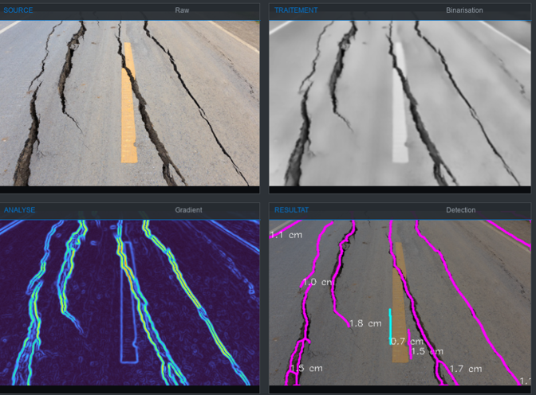
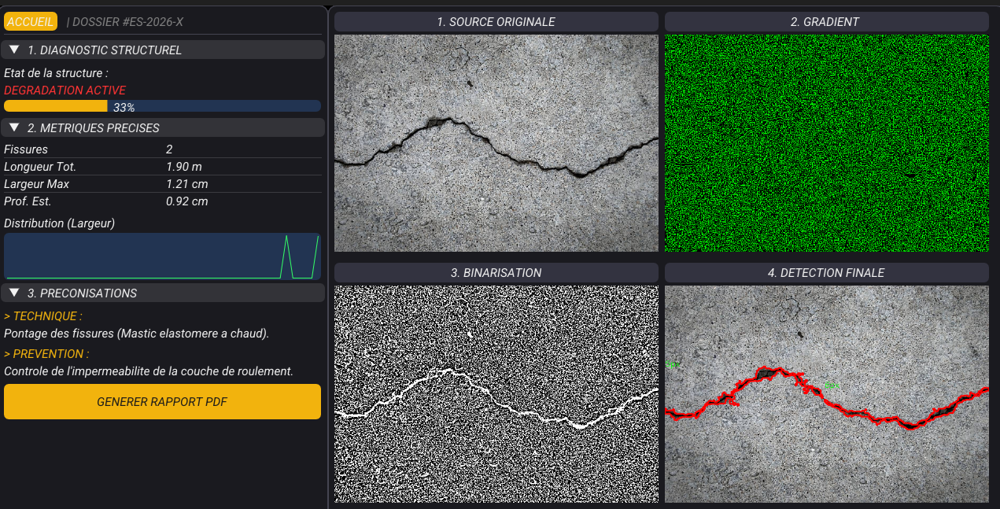
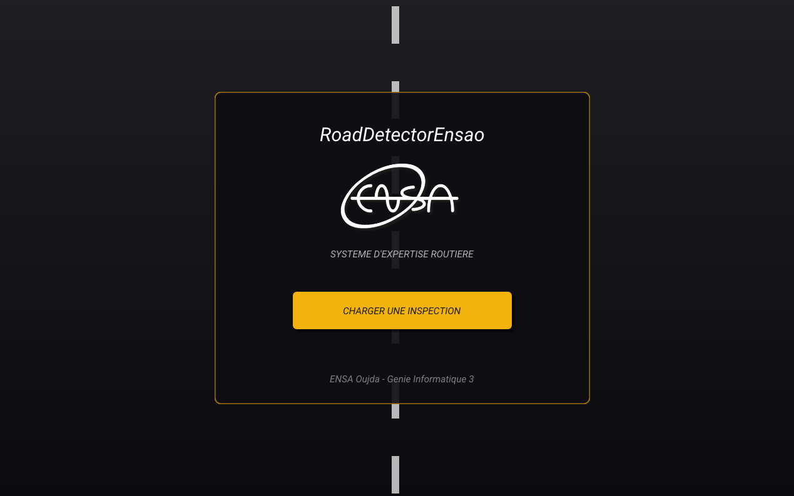
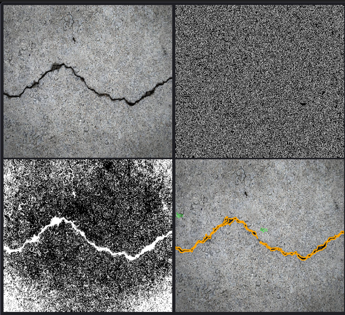
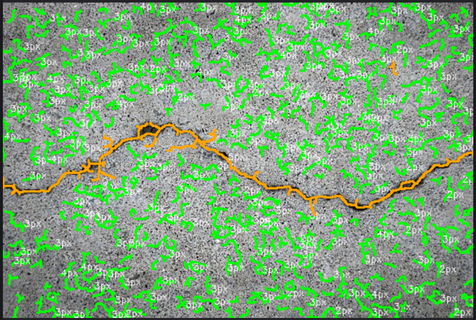
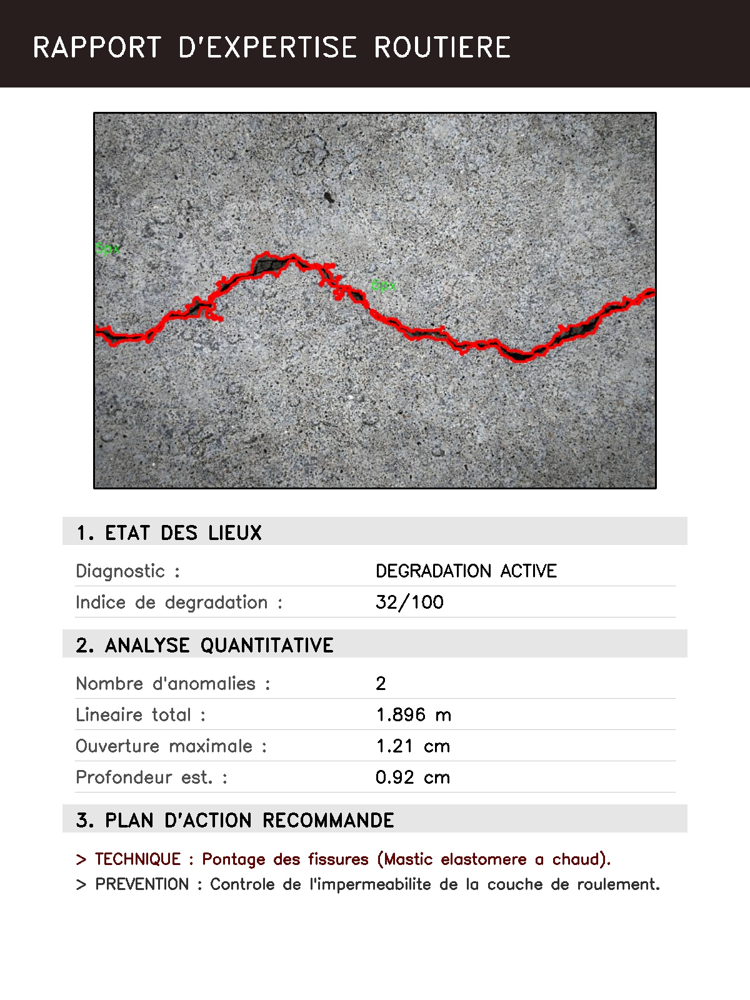
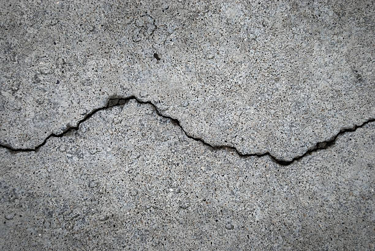

# 🚧 RoadDetectorEnsao — Système d’Expertise Routière

<p align="center">
  
</p>


> **Système expert de vision par ordinateur pour la détection, la mesure et la classification automatique des dégradations routières.**

---

## 📝 À propos

**RoadDetectorEnsao** est un logiciel desktop haute performance développé en **C++ natif**, destiné à l’analyse automatique de l’état des chaussées à partir d’images.

Contrairement aux approches classiques limitées à la simple détection, ce projet intègre un **pipeline avancé de vision par ordinateur** combiné à un **système expert décisionnel**, permettant de produire un **diagnostic structurel complet** :
- type de fissure
- sévérité
- recommandation de réparation

---

## ✨ Fonctionnalités Clés

- 🔍 **Détection précise**  
  Isolation robuste des fissures du bitume grâce à des filtres adaptatifs et morphologiques, même sous éclairage non uniforme.

- 📏 **Mesure algorithmique**  
  Implémentation de l’algorithme de **Zhang–Suen (squelettisation)** pour calculer la longueur réelle et la largeur moyenne des fissures.

- 🧠 **Système expert**  
  Classification automatique de la gravité (Faible, Moyenne, Critique) et génération de recommandations de maintenance (pontage, purge, reprofilage…).

- ⚡ **Architecture haute performance**  
  - Multithreading (thread de calcul séparé de l’interface)
  - Gestion mémoire optimisée (smart pointers, références)

- 🎨 **Interface professionnelle**  
  Interface graphique moderne basée sur **SDL3 + ImGui**, avec visualisation temps réel de chaque étape du traitement.

---

## 🛠️ Architecture Technique

### 🧠 Pipeline de Traitement d’Image

Le cœur du système repose sur une chaîne de traitement rigoureuse :

<p align="center">
  
</p>

<p align="center">
  
</p>

<p align="center">
  
</p>

<p align="center">
  
</p>

**Étapes principales :**
1. Acquisition de l’image routière
2. Amélioration du contraste (CLAHE)
3. Binarisation adaptative
4. Nettoyage morphologique
5. Squelettisation
6. Extraction de métriques géométriques
7. Diagnostic via règles expertes

---

## 🎨 Interface Graphique

<p align="center">
  
</p>

<p align="center">
  
</p>

L’interface permet :
- la navigation entre les étapes du pipeline
- la visualisation comparative (original / traité)
- l’affichage du diagnostic final et des mesures

---

## 🧱 Structure du Projet

```text
RoadDetectorEnsao/
├── assets/          # Images pour le README
├── src/             # Code source C++
├── include/         # Headers
├── lib/             # Librairies
├── fonts/           # Polices UI
├── obj/             # Fichiers objets
├── README.md
├── Makefile
make
./RoadDetectorEnsao
